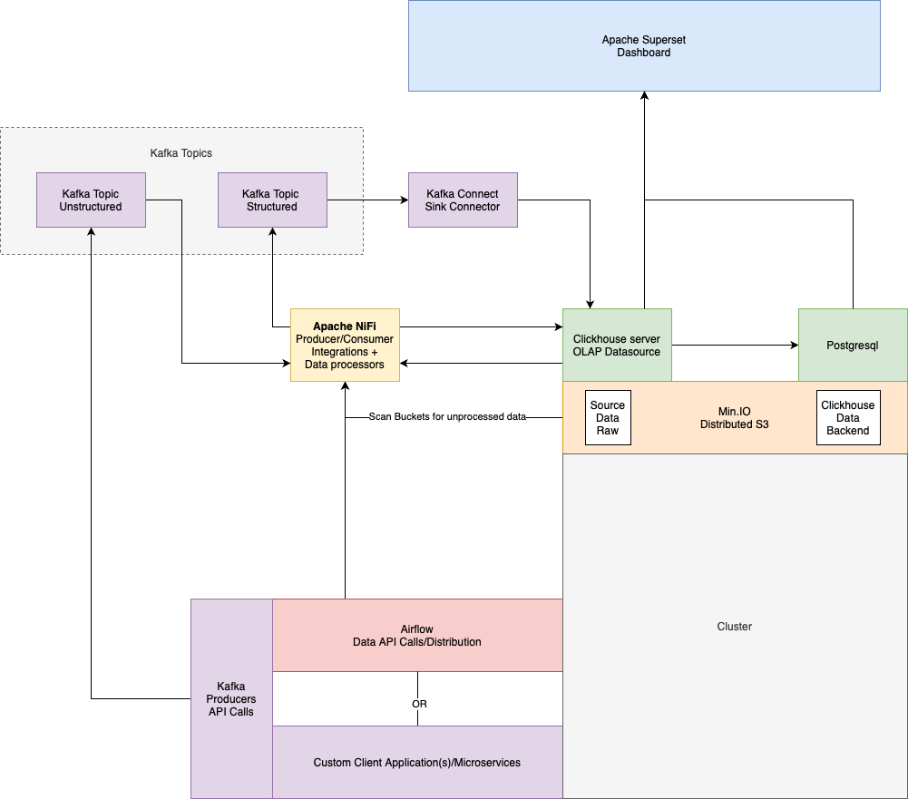

# Spotlight 

### Data aggregation and reporting for the public but on a platform that actually wants to be used

This goal of this project is to increase transparency over individuals in positions of notable power and influence. Financial and political conflicts of interests, illegal trading, abusive expendature of tax dollars, and regulative circumvention.

It aims largely to keep the focus of activist/investigative journalism on hard data, and encourage the community to engage in political and economic reform efforts.

It's also a way for me to hone some skills I am interested in, which is why you might see some 'over-engineered' components here. 

Demo: https://beta.spotlight-us.com

## Architecture
### Scheduling / Data retrieval
Data extraction pipelines run as Kafka Producers

Batch-heavy pipelines are scheduled and run by Airflow

'Always running' streaming data pipelines run in containers managed and load balanced by Hashicorp's Nomad

## Storage
Clickhouse and MinIO together handle data storage. Minio offers S3 API compatible object storage, and works as a backend to Clickhouse, so Clickhouse instances can run in distributed mode and be completely agnostic to where the data is mounted, decoupling db endpoints from storage. Some db servers could be on the same machine as S3 and this would be quite fast, but it's also not a requirement, and allows better configurability over data replication and availability efforts. 

## Processing
Apache NiFi will listen on Kafka topics the raw data is sent to and attempt to infer the proper type casts and insert the data into Clickhouse DB.

## Visualizaation
### Apache Superset
Clickhouse feeds right in to superset whcih auto-refreshs on configured intervals

# Front end

I am slowly merging my GovTrackr project with this to serve as the user client. It is built on Next.js, React, material-ui, Node/Express, GrapQL, Prisma CRM, and PostgreSQL. 

## See producers directory for data retreival pipelines

## See infra-stack directory for more in-depth information about the backend architecture
