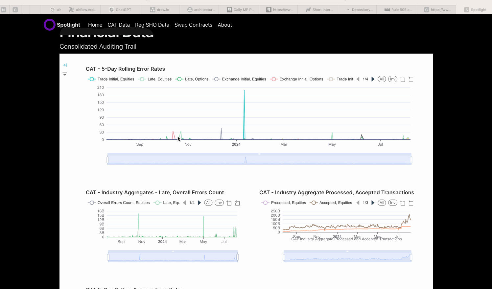

# Spotlight 
## Aggregated data from hard to reach places

Spotlight is a generalized regulatory data aggregation and user tracking platform aiming to increase transparency over influencial entities and dealings that shape our policies and economy. 

Inspired by projects such as FollowTheMoney, OpenSecrets, OpenBB, and Quiver Quantitative, Spotlight intends to augment these data sources into a more user friendly environment and add datasources and metrics currently not being tracked. It's also a way for me to hone some skills I am interested in, which is why you might see some 'over-engineered' components here. 

Demo: https://beta.spotlight-us.com

The Spotlight platform uses Airflow, Spark, Kafka, NiFi, ClickHouse, MinIO/S3, Postgres, Debezium, Superset, Terraform, and Nomad to pull, normalize, and store public datasets in a highly scalable and distributed environment. Web UI built with Next.js & Prisma/GraphQL

### Key Features:

#### User Accounts
Allow users to create accounts, track entities of interest, and receive customized updates.

#### Data-Driven Reporting
Provide detailed reports and insights to drive informed decision-making.

#### Increased Transparency
Make public filing records more accessible and comprehensible.

#### Accountability Focus
Highlight potential misuse of authority by individuals in positions of power, including the ultra-wealthy and elected officials.

Spotlight aims to shine a light on key figures and organizations, fostering a more transparent and accountable environment.

### Upcoming Features

- Personalized recommendations based on user interests.
- Advanced data visualization and reporting tools.
- Enhanced search and filtering options for improved data accessibility.

Spotlight's Next.js front end interfaces with Apache Superset to provide interactive, live-updating charts and tables of these datasets from one place. It also allows users to subscribe to and track specific entities, receiving receive tailored recommendations and updates.

Public datasets are either batch requested or streamed and stored in a concert of Clickhouse analytical, Postgres, and Milvus vector databases

Data which are published to different repositories with proprietary schema, but are otherwise the same or similar enough to be analyzed together, are cleaned, normalized, and combined. 

Most of the the sourced data is typically published only for regulatory purposes, and therefore only meets the bare minimum requirements of access. It is released as either PDF, or zip files containing only one day or week's worth of data. 

### Provided aggregated datasets 
#### Financial
##### Swaps
Swap data repositories (SDRs) sourced: 
- DTCC (SEC + CFTC)
- ICE (SEC + CFTC) 

Upcoming SDRs:
- CFTC (direct)
- CME Group
- Cboe

##### Fails to Deliver
Securities which have been sold short and naked (shares were not owned or borrowed up front), and which are not delivered in accordance with settlement window rules (T+2) are considered FTD.

##### Regulation SHO Threshold Lists
Different exchanges are all required to report on securities that meet the criteria for Reg SHO rule 204 (fails to deliver are not settled for 13 consecutive days). There is currently no entity that reports on or aggregates these lists from all exchanges

##### Consolidated Audit Trail (CAT) Errors
The Consolidated Audit Trail (CAT) is a regulatory initiative designed to improve market transparency and oversight by consolidating detailed trading data into a centralized repository. It enhances the ability of regulators to monitor market activity, detect potential abuses, and maintain market integrity. The CAT is a key tool for modernizing market surveillance and addressing the challenges highlighted by past market events.

#### Short Sale Circuit Breakers (Rule 201)

#### Rule 605 Reporting

See [./producers/finance] for more info on these datasets and their aggregation pipelines
