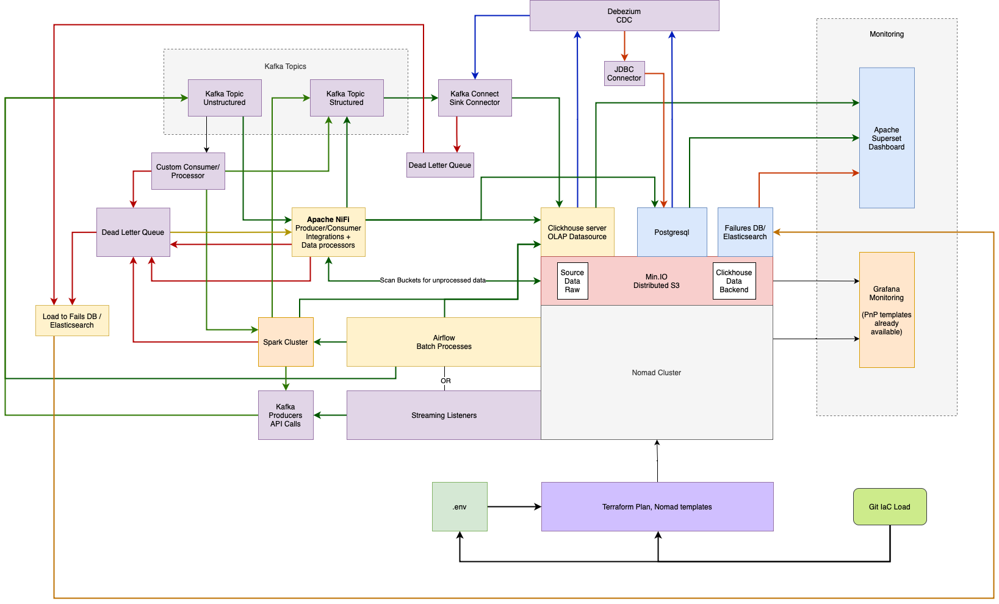

# Spotlight 
## Aggregated data from hard to reach places

Currently this project is focusing on aggregating financial data that is not currently offered by traditional platforms, and providing interactive environments to explore or download it, but its ultimate goal is to increase transparency over powerful entities such as major corporations or elected officials to shine a light on practices which may be negatively impacting society at as a whole.

It's also a way for me to hone some skills I am interested in, which is why you might see some 'over-engineered' components here. 

Demo: https://beta.spotlight-us.com

Spotlight's web front end interfaces with Apache Superset to provide interactive, live-updating charts and tables of these datasets from one place. 

The data is pulled daily and stored in an efficient distributed Clickhouse database using distributed S3 as its storage remote. 

Data which are published to different repositories with proprietary schema, but are otherwise the same or similar enough to be analyzed together, are cleaned, normalized, and combined. 

The data is typically published only for regulatory purposes, and therefore only meets the bare minimum requirements of access. It is released as either PDF, or zip files containing only one day or week's worth of data. 

### Provided datasets 
#### Swaps
Swap data repositories (SDRs) sourced: 
- DTCC (SEC + CFTC)
- ICE (SEC + CFTC) 

Upcoming SDRs:
- CFTC (direct)
- CME Group
- Cboe

#### Fails to Deliver
Securities which have been sold short and naked (shares were not owned or borrowed up front), and which are not delivered in accordance with settlement window rules (T+2) are considered FTD.

#### Regulation SHO Threshold Lists
Different exchanges are all required to report on securities that meet the criteria for Reg SHO rule 204 (fails to deliver are not settled for 13 consecutive days). There is currently no entity that reports on or aggregates these lists from all exchanges

#### Consolidated Audit Trail (CAT) Errors
The Consolidated Audit Trail (CAT) is a regulatory initiative designed to improve market transparency and oversight by consolidating detailed trading data into a centralized repository. It enhances the ability of regulators to monitor market activity, detect potential abuses, and maintain market integrity. The CAT is a key tool for modernizing market surveillance and addressing the challenges highlighted by past market events.

The problem is that access to the actual data respositories are restricted to the very organizations that it exists to regulate. It is maintained and reported by FINRA, which is bankrolled by the institutions involved in the transactions. It is only publicly disseminated in the form of monthly PDF reports. Provided here is a pipeline that downloads the pdfs automatically and converts them to tables which are loaded into a database and fed into Apache Superset

See [./producers/finance] for more info on these datasets and their aggregation pipelines

## Architecture
### Scheduling / Data retrieval
Data extraction pipelines run as Kafka Producers

Batch-heavy pipelines are scheduled and run by Airflow

'Always running' streaming data pipelines run in containers managed and load balanced by Hashicorp's Nomad, a lighter, faster alternative to Kubernetes

## Storage
Clickhouse and MinIO together handle data storage. Minio offers S3 API compatible object storage, and works as a backend to Clickhouse, so Clickhouse instances can run in distributed mode and be completely agnostic to where the data is mounted, decoupling db endpoints from storage. Some db servers could be on the same machine as S3 and this would be quite fast, but it's also not a requirement, and allows better configurability over data replication and availability efforts. 

## Processing
Apache NiFi will listen on Kafka topics the raw data is sent to and attempt to infer the proper type casts and insert the data into Clickhouse DB.

Data which needs more explicit transformation will be handled by custom python consumer/producers

## Visualizaation
### Apache Superset
Clickhouse feeds right in to superset which auto-refreshes on configured intervals

# Front end

I am slowly merging my GovTrackr project with this to serve as the user client. It is built on Next.js, React, material-ui, Node/Express, GrapQL, Prisma CRM, and PostgreSQL. 

## See ./producers for data retreival pipelines

## See ./infra-stack for more in-depth information about the backend architecture
